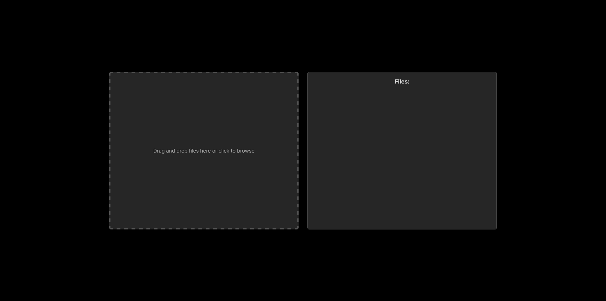
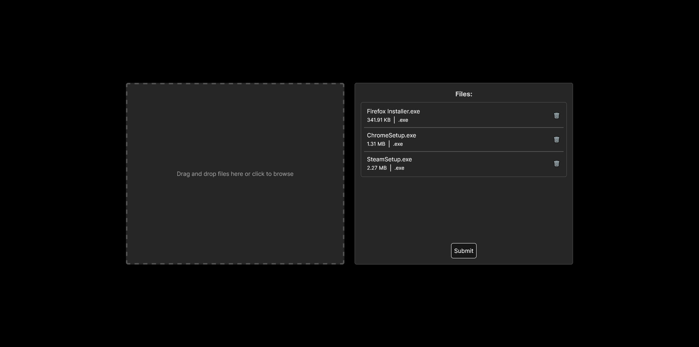
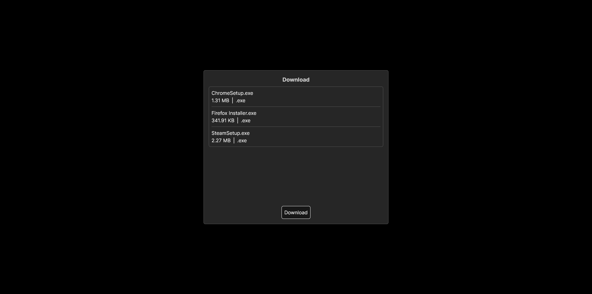

## file-transfer-nextjs.ts

This project is a showcase of a web application designed for uploading and sharing files. The application provides a user-friendly interface and robust functionality to facilitate seamless file sharing among users. It supports various file formats and efficient file transfers.

## Showcase

### Upload the files that you want to share



### Files queued for upload



### Download page



## Creation Process

Technologies used: Next.js, TailwindCSS, Zustand and jszip

This project was primarily developed using the powerful and versatile Next.js framework. The core objective of this endeavor was to create a robust and efficient file upload service that enables users to share files seamlessly over the web.

The design aspect of the page was not the primary focus during the development phase. Instead, the emphasis was placed on functionality and performance. The goal was to ensure that the file upload process was not only fast but also reliable and user-friendly.

By prioritizing speed and efficiency, the project aims to provide a superior user experience. Users can quickly upload their files and share them with others, making it an invaluable tool for both personal and professional use.

Despite the design not being the central focus, the page maintains a clean and straightforward interface. This simplicity in design further enhances the user experience by making the service easy to navigate and use.

## Lessons Learned

I knew a little about Next.js and its functionalities before starting this project. However, by the end of it, I had significantly improved my skills with this framework.

## Features

- ✔️ Upload functionality
- ✔️ Download functionality
- ❌ File encryption
- ❌ Keep files behind a password

## Running the Project Locally

This is a [Next.js](https://nextjs.org/) project bootstrapped with [`create-next-app`](https://github.com/vercel/next.js/tree/canary/packages/create-next-app).

## Getting Started

First, run the development server:

```bash
npm run dev
# or
yarn dev
# or
pnpm dev
```

Open [http://localhost:3000](http://localhost:3000) with your browser to see the result.

You can start editing the page by modifying `app/page.js`. The page auto-updates as you edit the file.

This project uses [`next/font`](https://nextjs.org/docs/basic-features/font-optimization) to automatically optimize and load Inter, a custom Google Font.

## Learn More

To learn more about Next.js, take a look at the following resources:

- [Next.js Documentation](https://nextjs.org/docs) - learn about Next.js features and API.
- [Learn Next.js](https://nextjs.org/learn) - an interactive Next.js tutorial.

You can check out [the Next.js GitHub repository](https://github.com/vercel/next.js/) - your feedback and contributions are welcome!

## Deploy on Vercel

The easiest way to deploy your Next.js app is to use the [Vercel Platform](https://vercel.com/new?utm_medium=default-template&filter=next.js&utm_source=create-next-app&utm_campaign=create-next-app-readme) from the creators of Next.js.

Check out our [Next.js deployment documentation](https://nextjs.org/docs/deployment) for more details.
